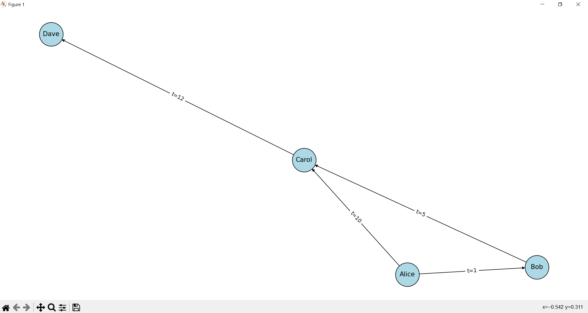

# DyGraL: A Domain-Specific Language for Dynamic and Temporal Graphs

## Overview

**DyGraL(Dynamic Graph Language)** is a Python-based domain-specific language (DSL) designed for the modeling, analysis, and querying of temporal and dynamic graphs.

Unlike static graph libraries, DyGraL introduces time as a primary dimension, enabling users to capture the evolution of networks over time, perform temporal queries, and investigate dynamic structures such as motifs and reachability in changing environments.

The project is structured as a research prototype intended for further exploration and extension in graph theory, computer science, and data science applications.

---

## Features

**- Temporal Graph Construction:**
Define time-stamped edges and nodes with optional attributes.

**- Snapshot Extraction:**
Generate static graphs corresponding to any time window for further analysis.

**- Temporal Queries:**
Reachability, shortest paths, degree, and motif detection evaluated with respect to time.

**- Streaming Ingestion:**
Append edges incrementally using a streaming context manager, with optional update callbacks.

**- Temporal Logic Utilities:**
Minimal temporal logic functions (always, eventually) for asserting time-dependent properties.

**- Integration with NetworkX:**
DyGraL snapshots are fully compatible with NetworkX algorithms.

---

## Installation

1. Clone the repository:
```bash
git clone https://github.com/yourname/DyGraL.git
cd DyGraL
```

2. Create and activate a virtual environment:
```bash
python -m venv .venv
source .venv/bin/activate   # On Windows: .venv\Scripts\activate
```

3. Install dependencies:
```bash
pip install -r requirements.txt
```

4. Install the package in editable mode:
```bash
pip install -e .
```

---


## Examples

The repository contains an examples directory that illustrates the basic usage of DyGraL.

**Example:** `basic_example.py`
```bash
from dygral import TemporalGraph, TemporalQueries, GraphStream

def run_example():
    G = TemporalGraph(directed=True)

    # Add edges with timestamps
    G.add_edge("Alice", "Bob", t=1)
    G.add_edge("Bob", "Carol", t=5)
    G.add_edge("Alice", "Carol", t=10)
    G.add_edge("Carol", "Dave", t=12)
    G.add_edge("Eve", "Alice", t=15)

    queries = TemporalQueries(G)

    print("Edges (time, u, v):")
    for e in G.list_edges():
        print(e)

    print("\nReachable Alice -> Carol at t=7?")
    print(queries.reachable_at("Alice", "Carol", 7))  # True

    print("\nShortest path Alice -> Dave at t=12")
    path, times = queries.shortest_path_at("Alice", "Dave", 12)
    print("Path:", path)
    print("Edge times:", times)

    print("\nDegree of Bob at t=6:")
    print(queries.degree_at("Bob", 6))

    print("\nFind chain motifs length=3 within 6 time units:")
    motifs = queries.chain_motifs(length=3, within=6)
    for nodes, times in motifs:
        print(nodes, times)

    print("\nStreaming ingestion:")
    def on_update(u, v, t, **a):
        print(f"Stream added {u}->{v} at t={t}")
    with GraphStream(G, on_update=on_update) as s:
        s.ingest("Dave", "Eve", t=16)
        s.ingest("Eve", "Frank", t=18)

    print("\nReachable Alice -> Frank at t=20?")
    print(queries.reachable_at("Alice", "Frank", 20))

if __name__ == "__main__":
    run_example()
```

Expected Output:

```bash
Edges (time, u, v):
(1, 'Alice', 'Bob', {})
(5, 'Bob', 'Carol', {})
(10, 'Alice', 'Carol', {})
(12, 'Carol', 'Dave', {})
(15, 'Eve', 'Alice', {})

Reachable Alice -> Carol at t=7?
True

Shortest path Alice -> Dave at t=12
Path: ['Alice', 'Carol', 'Dave']
Edge times: [10, 12]

Degree of Bob at t=6:
2

Find chain motifs length=3 within 6 time units:
['Alice', 'Bob', 'Carol'] [1, 1, 5]
['Alice', 'Carol', 'Dave'] [10, 10, 12]

Streaming ingestion:
Stream added Dave->Eve at t=16
Stream added Eve->Frank at t=18

Reachable Alice -> Frank at t=20?
True
```

The example demonstrates the core functionality of DyGraL: temporal edge insertion, snapshot queries, motif discovery, and streaming ingestion.


**Example:** `visual_example.py`

Example Visualization with NetworkX
```bash
import matplotlib.pyplot as plt
import networkx as nx
from dygral import TemporalGraph

G = TemporalGraph()
G.add_edge("Alice", "Bob", t=1)
G.add_edge("Bob", "Carol", t=5)
G.add_edge("Alice", "Carol", t=10)
G.add_edge("Carol", "Dave", t=12)

snapshot = G.snapshot(end_time=12)
pos = nx.spring_layout(snapshot)
labels = { (u, v): f"t={d['time']}" for u,v,d in snapshot.edges(data=True) }

plt.figure(figsize=(6,4))
nx.draw(snapshot, pos, with_labels=True, node_color="lightblue", node_size=2000, edgecolors="black")
nx.draw_networkx_edge_labels(snapshot, pos, edge_labels=labels)
plt.title("DyGraL Snapshot at t=12")
plt.show()
```


This produces a diagram of the graph snapshot at time 12, with edge labels showing their timestamps.

Example output visualization:




---

## API Summary
TemporalGraph
```bash
G = TemporalGraph(directed=True)
G.add_edge("A", "B", t=1, weight=0.5)
snapshot = G.snapshot(end_time=10)
```

TemporalQueries
```bash
queries.reachable_at("A", "C", t=7)
queries.shortest_path_at("A", "D", t=12)
queries.degree_at("B", t=6)
queries.chain_motifs(length=3, within=6)
```

GraphStream
```bash
with GraphStream(G) as s:
    s.ingest("X", "Y", t=20)
```

TemporalLogic
```bash
from dygral import TemporalLogic
TemporalLogic.always(lambda t: t < 15, [1, 5, 10])      # True
TemporalLogic.eventually(lambda t: t == 5, [1, 5, 10])  # True
```

---

## Testing

Run the unit tests using:
```bash
pytest -q
```

---

## Project Structure
```bash
DyGraL/
├── examples/
│   └── basic_example.py
├── src/
│   └── dygral/
│       ├── __init__.py
│       ├── core.py
│       ├── queries.py
│       ├── stream.py
│       └── temporal_logic.py
├── tests/
│   └── test_temporal_graph.py
├── requirements.txt
├── cli.py
├── pyproject.toml
└── README.md
```

---


## License
This project is licensed under the MIT License.

